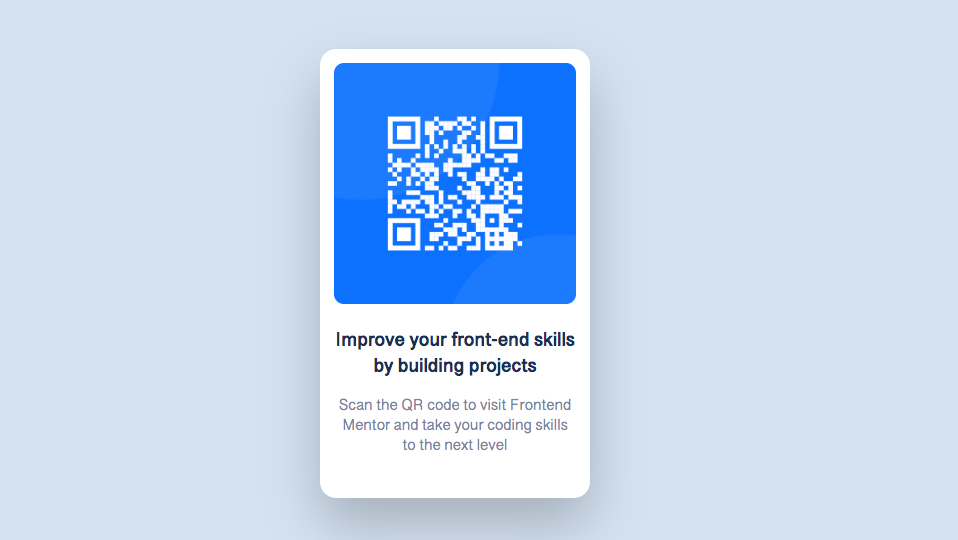

# Frontend Mentor - QR code component solution

This is a solution to the [QR code component challenge on Frontend Mentor](https://www.frontendmentor.io/challenges/qr-code-component-iux_sIO_H).

## Table of contents

- [Overview](#overview)
  - [Screenshot](#screenshot)
- [My process](#my-process)
  - [Built with](#built-with)
  - [What I learned and Continued development](#what-i-learned-and-continued-development)
- [Author](#author)

## Overview

### Screenshot

## My process

### Built with

- Semantic HTML5 markup
- CSS custom properties
- Flexbox

### What I learned and Continued development

This exercise helped me to know what my knowledge of HTML and CSS is, I can say that handling them this time was easy for me, however I saw that I still need to practice more flex box.

## Author

- Frontend Mentor - [@FatimaGR](https://www.frontendmentor.io/profile/FatimaGR)
